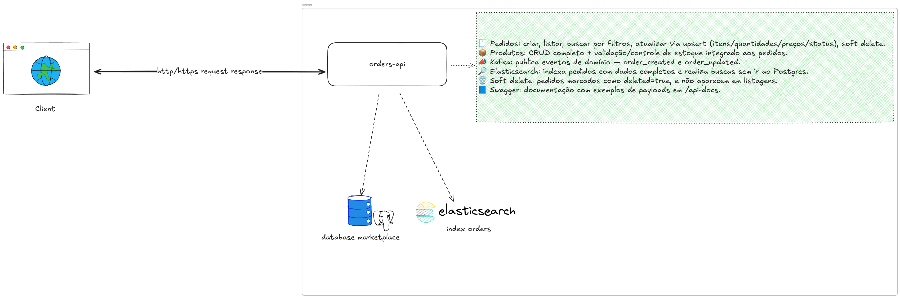

## 🚀 Orders API — NestJS + PostgreSQL + Kafka + Elasticsearch

### 🎨 Design System



API de gerenciamento de pedidos e produtos com NestJS, PostgreSQL (TypeORM + migrações), Kafka (kafkajs), Elasticsearch (busca avançada) e documentação via Swagger. Projeto preparado para rodar integralmente com Docker Compose (incluindo a própria API).

### ✨ Funcionalidades
- 🧾 CRUD de pedidos (criar, listar, buscar, atualizar via upsert, soft delete)
- 📦 CRUD de produtos (criar, listar, buscar, atualizar, remover)
- 📣 Eventos Kafka: `order_created` e `order_updated`
- 🔎 Elasticsearch para busca de pedidos
  - 💽 Indexação completa do pedido e itens (sem round-trip no DB)
- 🗑️ Soft delete de pedidos (`deleted=true`)
- 📘 Swagger com exemplos de payloads
- 🧰 Logs estruturados e validações (class-validator)

### 🧱 Arquitetura (alto nível)
- 🟢 `orders-api` (NestJS): Orders, Products, TypeORM, KafkaJS, ES client
- 🐘 Postgres: persistência via TypeORM (migrations)
- 🐳 Kafka (Bitnami KRaft): broker único + Kafka UI
- 🧠 Elasticsearch: índice `orders`

---

## ▶️ Como executar

Pré-requisitos: Docker e Docker Compose instalados.

1) 🐳 Subir tudo com Docker Compose
```bash
docker compose up ou docker compose up -d
```

URLs úteis:
- ✅ API: http://localhost:3000
- 📘 Swagger: http://localhost:3000/api-docs
- 📊 Kafka UI: http://localhost:8080
- 🔎 Elasticsearch: http://localhost:9200

2) 📝 Ver logs rápidos da API
```bash
docker logs -f orders-api
```

3) 🔁 Derrubar e subir novamente
```bash
docker compose down --remove-orphans
docker compose up ou docker compose up -d
```

ℹ️ Observação: O serviço `migrate-and-seed` roda migrations e seeds automaticamente na subida.

---

## 🔧 Variáveis de ambiente (principais)
As variáveis do container `app` já estão definidas no `docker-compose.yml` para a rede interna:
- `DB_HOST=postgres`
- `DB_PORT=5432`
- `DB_USER=postgres`
- `DB_PASSWORD=postgres`
- `DB_NAME=marketplace`
- `KAFKA_BROKERS=kafka:9092`
- `ELASTICSEARCH_NODE=http://elasticsearch:9200`

Para rodar a API localmente, utilize `.env.local` (ex.: `DB_HOST=localhost`, `KAFKA_BROKERS=localhost:9092`, `ELASTICSEARCH_NODE=http://localhost:9200`).

---

## 📚 Endpoints (resumo)
- 🧰 Products
  - `GET /products` — lista produtos
  - `POST /products` — cria produto
  - `PATCH /products/:id` — atualiza produto
  - `DELETE /products/:id` — remove produto

- 🧾 Orders
  - `GET /orders` — lista (com filtros via ES)
  - `GET /orders/:id` — busca por id
  - `POST /orders` — cria pedido (valida estoque, publica `order_created`)
  - `PATCH /orders/:id` — upsert de itens/atualização (publica `order_updated`)
  - `DELETE /orders/:id` — soft delete (mantém indexado; sem retorno de estoque)

📘 Documentação: `http://localhost:3000/api-docs`.

---

## 🧪 Fluxo básico (cURL)
1) 📦 Listar produtos
```bash
curl -s http://localhost:3000/products | jq .
```

2) ➕ Criar pedido
```bash
curl -s -X POST http://localhost:3000/orders \
  -H 'Content-Type: application/json' \
  -d '{
    "status":"PENDING",
    "items":[
      {"productId":"<UUID_prod_1>","quantity":1,"price":"129.90"}
    ]
  }' | jq .
```

3) 🔄 Atualizar pedido (upsert itens)
```bash
curl -s -X PATCH http://localhost:3000/orders/<ORDER_ID> \
  -H 'Content-Type: application/json' \
  -d '{
    "status":"PROCESSING",
    "items":[
      {"id":"<ITEM_ID_EXISTENTE>","quantity":2,"price":"129.90"},
      {"productId":"<UUID_prod_2>","quantity":1,"price":"199.90"}
    ]
  }' | jq .
```

4) 🗑️ Deletar pedido (soft delete)
```bash
curl -i -X DELETE http://localhost:3000/orders/<ORDER_ID>
```

---

## ✅ Testes
Executar testes (no diretório `orders-api`):
```bash
cd orders-api
npm test
```

Cobertura de testes unitários (principais):
- 🧪 `ProductsService` e `ProductsController`
- 🧪 `OrdersService` e `OrdersController` (create, findAll, findOne, update, remove)
- 🧪 DTOs: `CreateProductDto`, `UpdateProductDto`, `CreateOrderDto`, `UpdateOrderDto`, `OrderResponseDto`

### 📝 Logs

Exemplo de log em nível INFO (evento de domínio):

```bash
[2025-09-30 12:34:56.812] INFO  (orders-api/12345 on host): OrderCreated
    correlationId: "req-7f3f2f9b"
    orderId: "8b6e9d1c-9a2d-4b83-8b7f-1e92a7a5a1ab"
    status: "PENDING"
    itemsCount: 2
    totalAmount: "329.80"
```

---

## 🧭 Decisões técnicas
- 🧩 TypeORM com migrações (sem `synchronize: true`)
- 🔎 ElasticSearch retorna dados completos do pedido (sem segunda consulta ao Postgres)
- 🗑️ Soft delete (`deleted`) filtrado em `findAll`, `findOne` e buscas no ElasticSearch
- 📣 Eventos Kafka com `kafkajs`

---

## 🧯 Troubleshooting
- 🔌 Porta 3000 ocupada: pare instâncias anteriores (containers/locais)
- 📊 Kafka UI sem tópicos: Kafka deve anunciar `kafka:9092` e UI usar `kafka:9092`
- 🧭 Kafka local vs Docker: fora do Docker use `PLAINTEXT://localhost:9092`; dentro, `PLAINTEXT://kafka:9092`
- 🧠 Elasticsearch: versão 8.13.4; cliente Node compatível instalado

---

## 🛠️ Scripts úteis
No host:
```bash
docker compose up ou docker compose up -d     # sobe todos os serviços
docker compose down --remove-orphans          # derruba serviços
docker logs -f orders-api                     # logs da API
```

---

## 📄 Licença
MIT